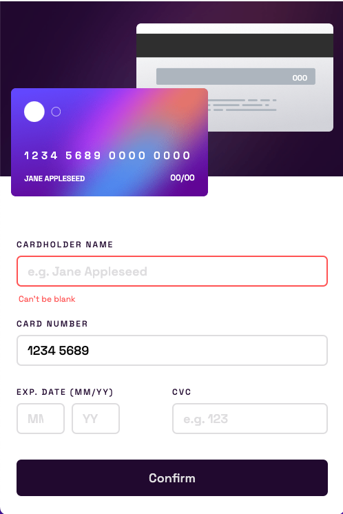
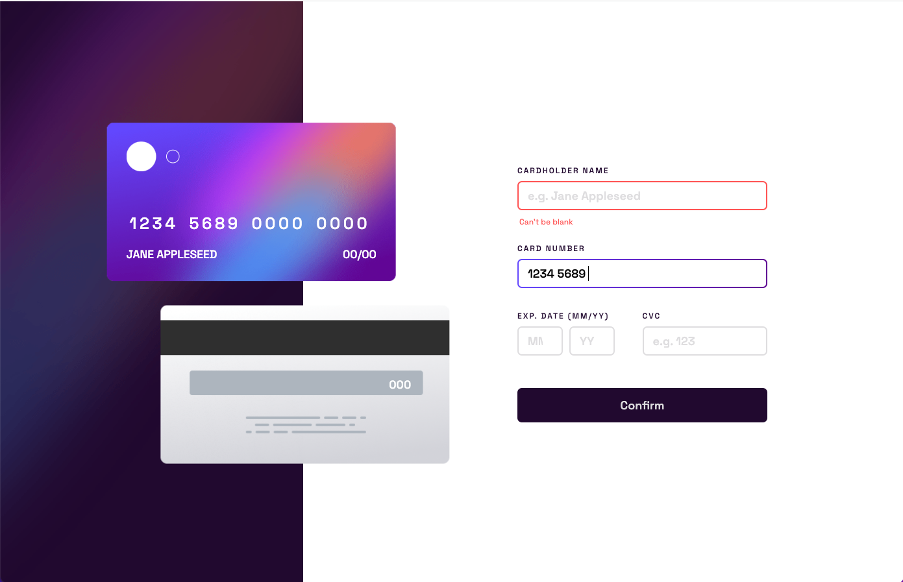

# Frontend Mentor - Interactive card details form solution

This is a solution to the [Interactive card details form challenge on Frontend Mentor](https://www.frontendmentor.io/challenges/interactive-card-details-form-XpS8cKZDWw).

## Table of contents

- [Overview](#overview)
  - [The challenge](#the-challenge)
  - [Screenshot](#screenshot)
  - [Links](#links)
- [My process](#my-process)

  - [Built with](#built-with)
  - [Tests](#what-i-learned)
  - [Continued development](#continued-development)

- [Author](#author)

## Overview

### The initial challenge

Users should be able to:

- Fill in the form and see the card details update in real-time
- Receive error messages when the form is submitted if:
  - Any input field is empty
  - The card number, expiry date, or CVC fields are in the wrong format
- View the optimal layout depending on their device's screen size
- See hover, active, and focus states for interactive elements on the page

### Screenshot

Mobile Solution

Desktop Solution

### Links

- Solution URL: [Add solution URL here](https://github.com/TheNewDevl/fem-card-form)
- Live Site URL: [Add live site URL here](https://thenewdevl.github.io/fem-card-form/)

## My process

### Built with

- JS (Vanilla)
- Jest (Testing)
- SASS
- Mobile-first workflow

### Tests

`npm run test` to run tests suite.

### Continued development

Improve animations.

## Author

- GitHub - [Carl Dev](https://github.com/TheNewDevl)
- Frontend Mentor - [@TheNewDevl](https://www.frontendmentor.io/profile/TheNewDevl)
